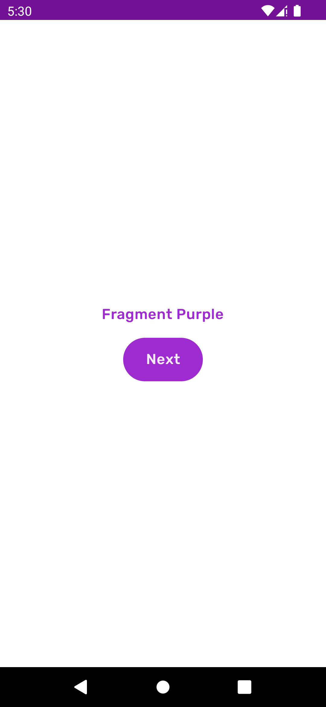
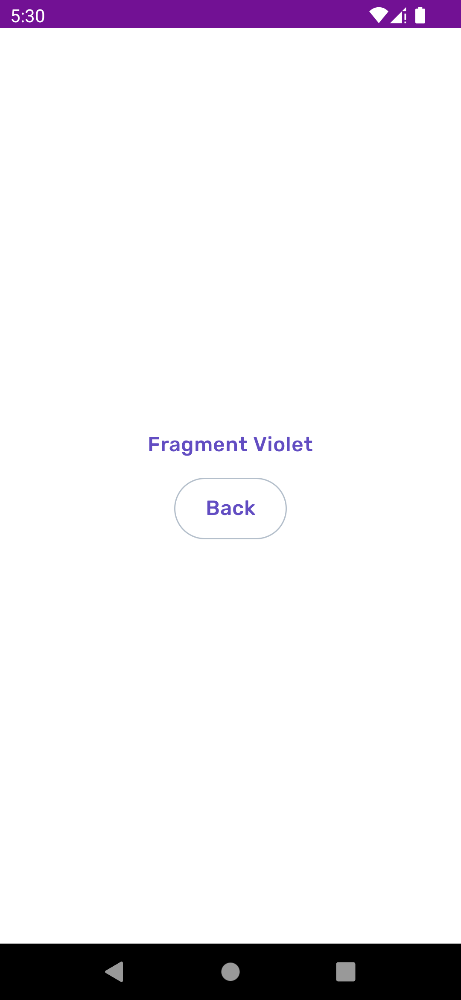

## Exercise

1. Apply App theme (Purple variant) to
   the [FragmentPurple](course://lesson1/task7/src/main/java/com/example/android/course/FragmentPurple.kt)
2. Create and apply Violet variant
   to [FragmentViolet](course://lesson1/task7/src/main/java/com/example/android/course/FragmentViolet.kt)

## Expected result

