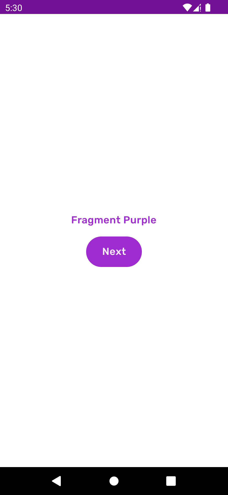
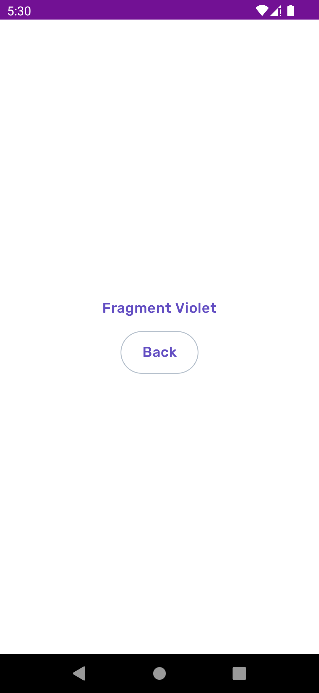

## Exercise

1. Apply App theme (Purple variant) to
   the [FragmentPurple](course://module2/exercise4/src/main/java/com/example/android/course/FragmentPurple.kt)
2. Create and apply Violet variant
   to [FragmentViolet](course://module2/exercise4/src/main/java/com/example/android/course/FragmentViolet.kt)
3. In code, using the nearest context, apply `colorPrimary` to the title text in both fragments

### Expected result: Run the app on a device and verify the visual changes.

